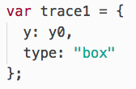
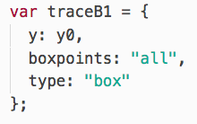
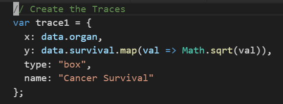
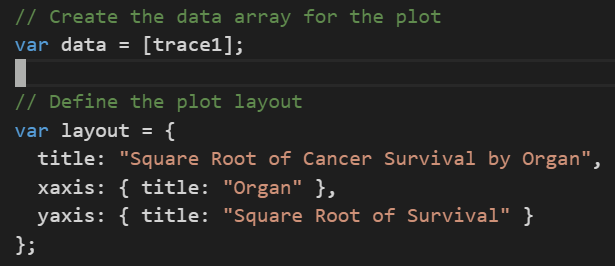

### 16. Instructor Do: Box Plots (0:10)

* Open [index.html](Activities/09-Ins_BoxPlot/Solved/index.html) in the browser to demonstrate what a box plot looks like and give the following explanation.

  * Explain that each box corresponds to a different distribution.

  * Explain that the line in the middle of the box identifies the median of the underlying data.

  * Explain that the upper/lower bounds of the box represent the upper/lower quartiles of the underlying data.

  * Explain that the lines outside and above/below the box represent the maximum/minimum of the underlying data.

  * Explain that these five numbers—minimum, lower quartile, median, upper quartile, and maximum—comprise what is often called the "Five Number Summary" of a distribution.

  * Remind students that each box summarizes an entire _distribution_ of data.

* Explain that box plots are useful tools for visualizing the "statistical similarity" between distributions.

* Encourage students to create box plots as a consistent step in the exploration phase of their analysis work.

* Now, open [plots.js](Activities/09-Ins_BoxPlot/Solved/plots.js) to go over the code with students.  Make sure to include:

  * The syntax for creating a boxplot with Plotly.

  

  * The option to render a scatter plot next to the box plot.

  

### 17. Students Do: Box Plots (0:15)

* Demonstrate the solved [index.html](Activities/10-Stu_BoxPlot/Solved/index.html) in the browser.

* Explain that this plot depicts survival rates of different kinds of cancer.

* **Files**

  * [plots.js](Activities/10-Stu_BoxPlot/Unsolved/plots.js)

  * [index.html](Activities/10-Stu_BoxPlot/Unsolved/index.html)

  * [cancer_metadata.md](Activities/10-Stu_BoxPlot/Unsolved/cancer_metadata.md)

* **Instructions**

  * Create a box plot for each of the organ types.

  * Calculate the square root of the survival as the depended variable.

    * Use `map` to apply the square root.

* **BONUS**

  * Plot all of the data points next to each box plot using attributes available in the plotly documentation for [box plots](https://plot.ly/javascript/reference/#box-boxpoints)

### 18. Everyone Do: Review Box Plot Activity (0:10)

* Open the solved [plots.js](Activities/10-Stu_BoxPlot/Solved/plots.js).

* Explain `trace1`. In particular, emphasize the relationship and significance of the `x` and `y` properties.

  

* Point out that the `layout` object contains `xaxis` and `yaxis` keys, where we can exert fine control over cosmetic details of the plot.

  
